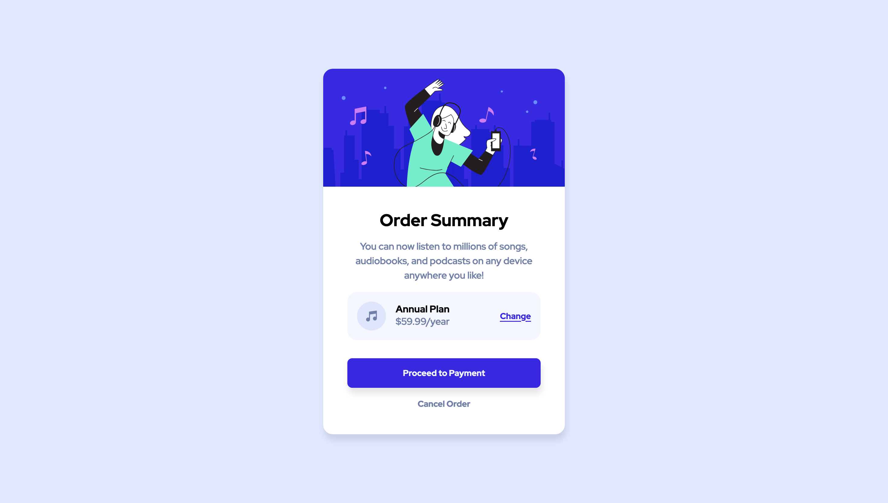

# Frontend Mentor - Order summary card solution

This is a solution to the [Order summary card challenge on Frontend Mentor](https://www.frontendmentor.io/challenges/order-summary-component-QlPmajDUj). Frontend Mentor challenges help you improve your coding skills by building realistic projects. 

## Table of contents

- [Overview](#overview)
  - [The challenge](#the-challenge)
  - [Screenshot](#screenshot)
  - [Links](#links)
- [My process](#my-process)
  - [Built with](#built-with)
  - [What I learned](#what-i-learned)
- [Author](#author)

## Overview

### The challenge

Design a card component with hover states.

### Screenshot



### Links

- [Solution](https://github.com/ryanthayes/fem-summary-component)
- [Live URL](https://ryanthayes.github.io/fem-summary-component)

## My process

### Built with

- Semantic HTML5 markup
- CSS custom properties
- Flexbox

### What I learned

Instead of using a class two modify the two buttons on the bottom of the layout, I experimented with using "data attributes". I am not sure which is better standard practice, but I have seen this technique used by a couple YouTubers, so I wanted to give it a try.

```css
.button {
  cursor: pointer;
  font-size: var(--fs-300);
  font-weight: var(--fw-bold);
  color: var(--clr-neutral-200);
  background-color: transparent;
  padding: 1em 2em;
  width: 100%;
  border: none;
  border-radius: 0.5rem;
}
.button[data-type="primary"] {
  margin-top: 1em;
  background-color: var(--clr-primary-400);
  box-shadow: var(--shadow);
}
.button[data-type="primary"]:hover,
.button[data-type="primary"]:focus {
  background-color: var(--clr-primary-300);
}
.button[data-type="naked"] {
  color: var(--clr-neutral-400);
  padding: 0;
}
.button[data-type="naked"]:hover,
.button[data-type="naked"]:focus {
  color: var(--clr-neutral-800);
}
```

## Author

- Github - [@ryanthayes](https://github.com/ryanthayes)
- Frontend Mentor - [@ryanthayes](https://www.frontendmentor.io/profile/ryanthayes)